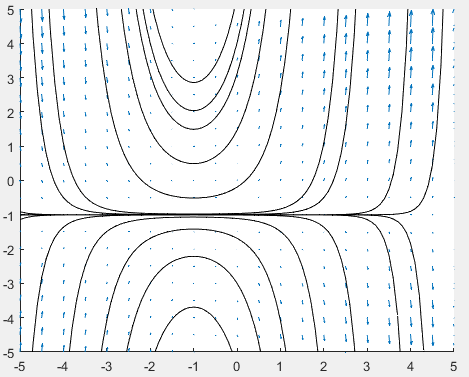
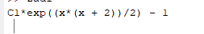
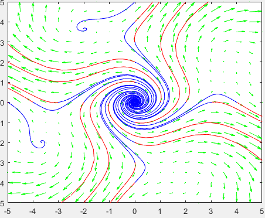
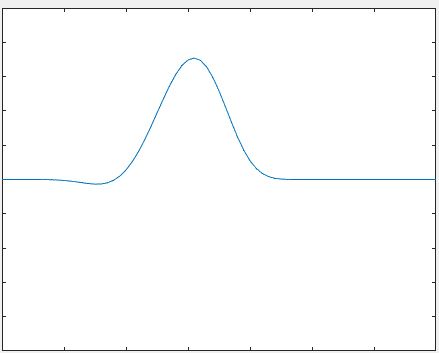
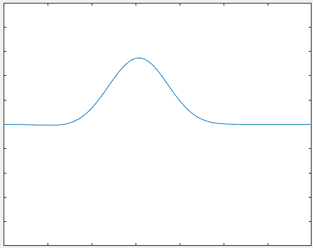
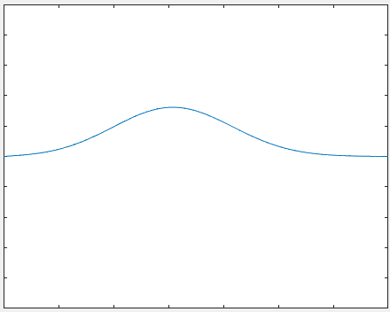

### ФН: 3MI0700035 Иван Петров

# Задaча 1

## Код
```matlab
%Зад1 б) y'=(y+1) * (x+1); Начертайте векторно поле {x[-5,5], y[-5,5]}

[x, y] = meshgrid(-5:0.5:5);
u = ones(size(x));
v = (y+1).*(x+1);

hold on;
quiver(x,y,u,v);
axis([-5,5,-5,5]);

% Интегралните криви на уравнението: в)
% y' = y'=(y+1) * (x+1)
%a=-5;
%b=-5;
[a,b]=ginput(1);
syms x y(x)
eq1 = diff(y, x) == (y+1).*(x+1);
while a >= -5 && a <= 5 && b >= -5 && b <= 5
ic1 = y(a) == b;
sol1 = dsolve(eq1, ic1);
xx = -5:0.1:5;
yy = double(subs(sol1, 'x', xx));
plot(xx, yy, 'k');
[a,b]=ginput(1);
%a=a+1;
%b=b+1;
end

% a) Общо решение на уравнението
S = dsolve(eq1);
disp(S);
```

## Графика


## Общо решение на уравнението



***
***
### ФН: 3MI0700035

# Задача 2

## Код

```matlab
[x, y] = meshgrid(-5:0.5:5);
u = x-4.*sin(y);
v = y+4.*sin(x);

quiver(x,y,u,v,'g');
axis([-5,5,-5,5]);


a=[-5,-4, -3, -2, -1,1,2,3,4,0,0,0,0,0,0,0,0,0];
b = [0,0,0,0,0,0,0,0,0,-4,-3,-2,-1,1,2,3,4,5];

% фазов портрет
hold on

    [t,x] = ode45(@solver, [0,-4], [2,0]); 
    plot(x(:,1), x(:,2), 'g');
for k = 1:length(a)
    [t,x]=ode45(@solver, [0,4], [a(k), b(k)]);
    plot(x(:,1), x(:,2), 'r'); 
    [t,x] = ode45(@solver, [0,-4], [a(k), b(k)]); 
    plot(x(:,1), x(:,2), 'b');

end
axis([-5,5,-5,5]);
```

```matlab
function res = solver(t, x)
res = [x(1)-4.*sin(x(2));
x(2)+4.*sin(x(1))];
end
```


## Графика



***
***
### ФН: 3MI0700035

# Задача 3

## Код

```matlab
clear all
format long
tau = 0.005;
h = 0.1;

t = 0:tau:1;
x = 0:h:7;

M = length(t);
N = length(x);

u = zeros([N,M]);

for m = 1:M
    u(1,m) = 0;
    u(N,m) = 0;
end
for n = 1:N
    u(n,1) = phi5(x(n));
end

for m = 1:M-1
    for n = 2:N-1
        u(n,m+1) = u(n,m) + tau/h^2*(u(n+1,m) - 2*u(n,m) + u(n-1,m));
    end
end

for m = 1:M
    plot(x,u(:,m))
    axis([0,7,-10,10])
    MM(m) = getframe;
end
movie(MM,5,24)
```

```matlab
function res=phi5(x)

for n=1:length(x)
    if x(n)>=1 && x(n)<=4
        res(n)= (x-2).*((x-4).^2).*(x-1).^3;
    else
        res(n)= 0;
    end 
end
```

## Графика



